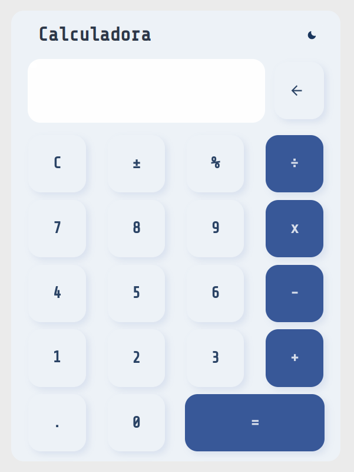

<h1 align="center">Calculadora React</h1>

---

## 📝 Tabela de conteúdo

-   [Sobre](#about)
-   [Preview](#demo)
-   [Deploy](#deployment)
-   [Construído usando](#built_using)
-   [Rodando o projeto](#getting_started)
-   [Autores](#authors)

## 🧐 Sobre <a name = "about"></a>

Esse projeto consiste em uma calculadora simples, feita pra testar meus conhecimentos em React, seus hooks e algumas tecnologias.

## 🎥 Preview <a name = "demo"></a>



## ⛏️ Consturído usando <a name = "built_using"></a>

-   [React](https://pt-br.reactjs.org/) - Framework Javascript para criação de aplicações web
-   [Chakra UI](https://chakra-ui.com/) - Biblioteca de componentes
-   [Frammer Motion](https://www.framer.com/motion/) - Biblioteca para animação e gestos
-   [Vite](https://vitejs.dev/) - Ferramenta de build

## 🚀 Deploy <a name = "deployment"></a>

Para visualizar a aplicação, acesse:

-   **Netlify**: https://jovial-sunburst-a6668f.netlify.app/

---

## 🏁 Rodando o projeto <a name = "getting_started"></a>

Siga as seguintes instruções para rodar a aplicação em sua máquina.

### Pré-requisito

Para executar esse projeto, você vai precisar do gerenciador de pacotes do Node(npm) instalado em sua máquina.

Faça o clone do projeto e siga para seção de instalação

```
gh repo clone Vsspaulasouza/calculadora-react
```

### Instalação

Instale todas as dependências do projeto

```
npm i
```

Após instalar as dependências, basta executar o projeto

```
npm run dev
```

Após isso será gerado um link para acesso à aplicação rodando em seu ambiente local.

---

## ✍️ Autores <a name = "authors"></a>

| [](https://github.com/Vsspaulasouza) |
| -------------------------------------------------------------------------------------------------------------- |
| [Vinícius Soares](https://github.com/Vsspaulasouza)                                                            |
